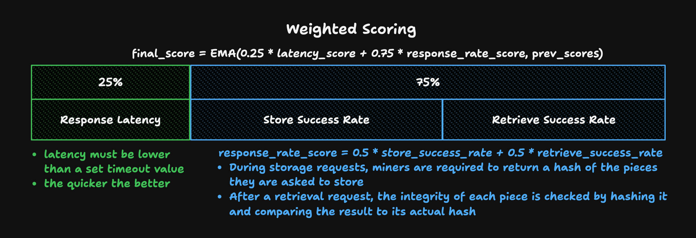

# Storb - An Overview

## TLDR

The subnet can be used as shown below:


Uploading files

- Client hits a validator endpoint to upload a file. This can be done by sending a file to its http endpoint:

    ```bash
    curl -X POST http://{ip}:{port}/file -F "file=@{path/to/file}"
    ```

- The validator splits up the file into erasure-coded pieces that are then distributed to miners.
- The validator distributes the file metadata to other neurons through a DHT.
- Returns an infohash which can be used by user to download the file from the network:

    ```
    4e44d931392d68ec0318f09d48267d05c4a8d9fe852832adeeaefc47a892d23c
    ```

Retrieving files

- Client requests for a file through a validator. Also done through its http endpoint:

    ```bash
    curl -X GET http://{ip}:{port}/file?infohash={infohash}
    ```

- The validator uses the DHT to determine where the file pieces are stored then requests the pieces from the miners.
- The validator reconstructs the file with the pieces and sends it back to the client.

## Scoring Mechanism



Scoring is made up of multiple components:

- **Latency**: Miners are scored based on how quickly they respond to storage and retrieval requests.
- **Response Rate**: Reliable miners are the name of the game. The less a miner responds with valid data to storage and retrieval requests, the lower it is scored.
- **Data validation**: There's no point in having a miner with low latency and high response rates if the data they return is invalid. To ensure that miners are consistently returning the correct data, the integrity of the data they return is also taken into account.

## Chunking and Piecing

Files are split into erasure-coded chunks, and subsequently split into pieces and stored across various miners for redundancy.


## DHT for File Metadata

File metadata — which is useful for querying miners for pieces, and, eventually, reconstructing files — is replicated and stored across neurons in the subnet in the form of a DHT.


